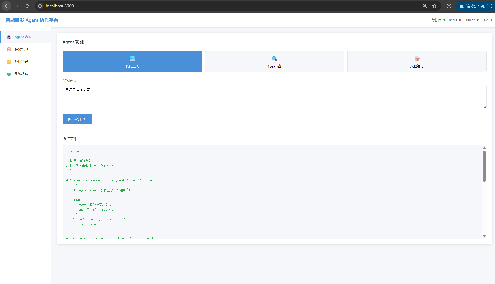
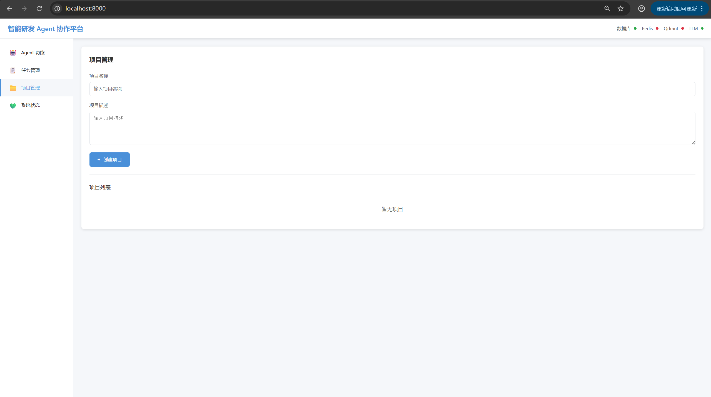
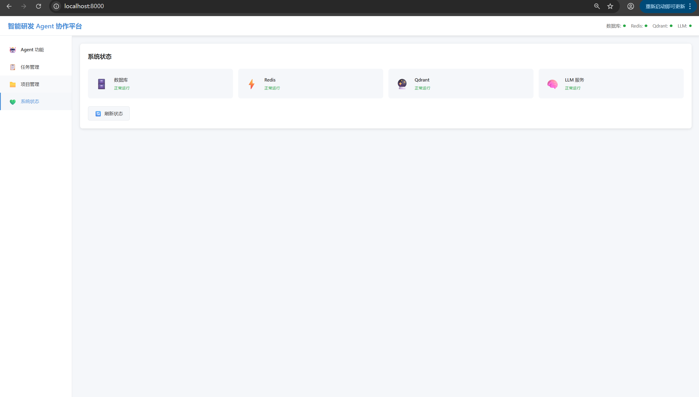

# 智能研发 Agent 协作平台

基于 FastAPI + DeepSeek LLM 构建的智能研发协作平台。

## 功能特性

- 🤖 **代码生成 Agent** - 基于 DeepSeek LLM 自动生成代码
- 🔍 **代码审查 Agent** - 自动化代码审查和质量评估
- 📝 **文档编写 Agent** - 自动生成项目文档
- 📋 **任务管理** - 完整的任务 CRUD 操作
- 📁 **项目管理** - 多项目并行管理
- 🧠 **分层记忆架构** - Qdrant 向量数据库 + Redis 缓存

## 界面预览

### 🤖 Agent 功能


### 📋 任务管理


### 📁 项目管理


### 📊 系统状态


## 技术栈

- **后端框架**: FastAPI
- **大语言模型**: DeepSeek LLM、LangChain
- **数据库**: SQLite / MySQL
- **向量数据库**: Qdrant
- **缓存**: Redis
- **前端**: HTML5 + CSS3 + JavaScript

## 快速开始

### 安装依赖

```bash
pip install -r requirements.txt
```

### 运行项目

```bash
python main.py
```

### 访问地址

- 前端页面: http://localhost:8000
- API 文档: http://localhost:8000/docs
- 健康检查: http://localhost:8000/health

## API 接口

| 接口 | 方法 | 路径 |
|------|------|------|
| 代码生成 | POST | /agent/code/generate |
| 代码审查 | POST | /agent/code/review |
| 文档编写 | POST | /agent/document/write |
| 获取任务列表 | GET | /tasks/ |
| 创建任务 | POST | /tasks/ |
| 获取项目列表 | GET | /projects/ |
| 创建项目 | POST | /projects/ |

## 目录结构
